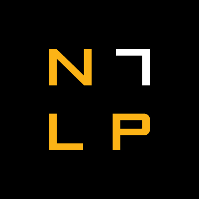

  [![Contributors][contributors-shield]][contributors-url] [![Forks][forks-shield]][forks-url] [![Stargazers][stars-shield]][stars-url] [![Issues][issues-shield]][issues-url] [![MIT License][license-shield]][license-url] [![LinkedIn][linkedin-shield]][linkedin-url]

<!-- PROJECT LOGO -->
<br />

<p align="center">
  <a href="https://github.com/vineeths96/Natural-Language-Inference">
    
  </a>
  <h3 align="center">Natural Language Inference (NLI)</h3>
  <p align="center">
    Natural Language Inference (NLI) using SNLI dataset.
    <br />
    <a href=https://github.com/vineeths96/Natural-Language-Inference><strong>Explore the repository»</strong></a>
    <br />
    <br />
    <a href=https://github.com/vineeths96/Natural-Language-Inference/blob/master/results/Project3.pdf>View Problem Statement</a>
    <a href=https://github.com/vineeths96/Natural-Language-Inference/blob/master/results/Deep_Learning_Report_3.pdf>View Report</a>
  </p>


</p>

> tags : natural language inferencing, natural language processing, NLI, SNLI, MNLI, deep learning, tensorflow

<!-- TABLE OF CONTENTS -->
## Table of Contents

* [About the Project](#about-the-project)
  * [Built With](#built-with)
* [Getting Started](#getting-started)
  * [Prerequisites](#prerequisites)
  * [Instructions to run](#instructions-to-run)
* [Models overview](#models-overview)
  * [Logistic regression](#logistic-regression)
  * [Deep learning models](#deep-learning-models)
* [Results](#results)
* [License](#license)
* [Contact](#contact)
* [Acknowledgements](#acknowledgements)


<!-- ABOUT THE PROJECT -->
## About The Project

This project is an implementation of the task of Natural Language Inference (NLI). In this task, we are given two sentences called premise and hypothesis. We are supposed to determine whether the ”hypothesis” is true (entailment), false (contradiction), or undetermined (neutral) provided that the ”premise” is true. For this project, we have used the [Stanford Natural Language Inference](https://nlp.stanford.edu/projects/snli/) (SNLI) dataset. From the dataset, we use the files `snli_1.0_train.jsonl` for training the model and `snli_1.0_test.jsonl` for testing the model. From each entry in these files, we consider the fields corresponding to `gold_label`, `sentence1` and `sentence2`. `sentence1` serves as the premise and `sentence2` serves as the hypothesis and `gold_label` serves as the relationship label. The following models were implemented and the performance was evaluated. 

* Logistic regression classifier using TF-IDF features
* Deep model classifiers for text such as GRU, LSTM and SumEmbeddings  
* BERT-based classifiers (Only implementation code is available. Unable to train and test due to scarcity of resources)

### Built With
This project was built with 

* python v3.7
* tensorflow v2.1
* The list of libraries used for developing this project is available at [requirements.txt](requirements.txt).


<!-- GETTING STARTED -->

## Getting Started

Clone the repository into a local machine using

```shell
git clone https://github.com/vineeths96/Natural-Language-Inference
```

### Prerequisites

Please install required libraries by running the following command (preferably within a virtual environment).

```shell
pip install -r requirements.txt
```

The [Stanford Natural Language Inference](https://nlp.stanford.edu/projects/snli/) dataset has to be downloaded from [here](https://nlp.stanford.edu/projects/snli/snli_1.0.zip). THe file has to be extracted and the files `snli_1.0_train.jsonl` and `snli_1.0_test.jsonl` have to be saved in the `./input/` directory.  *generate_meta_input()* function from *utils* package has to be executed to generate cleaned and processed data. This can be done by uncommenting the corresponding code snippet in the main function when the program is run for the first time. This function takes care of text preprocessing which is explained in detail in the report. The processed data is stored as pickled list files at `./input/data_pickles/` directory.

[GloVe embedding]( https://nlp.stanford.edu/projects/glove/) from Stanford has been used throughout this project to embed the words to vectors.  The GloVe embedding with 6 billion token is used for embedding. The corresponding file has to be download from [here](https://nlp.stanford.edu/data/glove.6B.zip) and extracted to `/input/embedding/` directory. This is required only if we intend to retrain the model. 

NB: The SNLI dataset contains entries without any gold_labels (label of “-”). As of writing this report, it was chosen to ignore those entries and delete them from the dataset as they do not add any information.

### Instructions to run

The `main.py` is the interface to the program. It is programmed to run in two modes – train mode and test mode. The `main.py` file takes two optional command line argument, one to specify the mode of execution – whether to train or test model,  and another one to specify the model architecture to be used. The `main.py`, when executed without any arguments, enters into testing the logistic regression model and the SumEmbeddings deep model, and produces the output files `deep_model.txt` and `tfidf.txt` respectively.

The `main.py` when executed with the (optional argument) `--train-model` enters into training mode and saves the models after training. The model to be used for training/testing can be specified with the (optional argument) `--model-name`.  Model name can be one among the following: BiGRU, BiLSTM, SumEmbeddings, and BERT.

##### Train mode

```shell
python main.py --train-model --model-name <model_name>
```

##### Test mode

```shell
python main.py --model-name <model_name>
```


## Models overview

#### Logistic regression

Logistic regression model was trained using TF-IDF (Term Frequency-Inverse Document Frequency) features obtained using *sklearn* python library. The feature vector used to train the model is obtained by concatenating the TF-IDF vectors of premise and hypothesis. The model is trained (fit) using L-BFGS (Limited memory - Broyden–Fletcher–Goldfarb–Shanno algorithm) solver with a maximum iteration limit of 1000. The trained (fit) model is saved at `./models/LR.pickle` for future uses and testing. The model attains an accuracy of **63.38%** and the results of prediction are written to a file at `./tfidf.txt`.

#### Deep learning models

The first step towards implementing a deep model for text is to convert each atomic discrete entity in the input (words or characters) into real vectors from $ \mathbf{R}^{d} $ so that their semantics are captured meaningfully. For this purpose, GloVe embedding has been used in this project. Different pretrained GloVe embeddings are available and the embedding chosen for this project is the one with 6 billion tokens trained over Wikipedia corpus. Once the training is completed the model is stored at `./model/` directory as a h5 file.

##### BiGRU (Bidirectional Gated Reccurent Unit)

The model attains an accuracy of **78.58%** and the output text file and plots are saves at `./results/BiGRU/`.

##### BiLSTM (Bidirectional Long  Short Term Memory)

The model attains an accuracy of **76.38%** and the output text file and plots are saves at `./results/BiLSTM/`.

##### SumEmbeddings

A SumEmbedding lambda layer, which sums up all the embedding vectors in the sentence is used in this model. The model attains an accuracy of **80.38%** and the output text file and plots are saves at `./results/SumEmbeddings/`. Since this is the best performing model the output text files are stored at `./deep_model.txt` as well

##### BERT (Code-only)

An experimental Huggingface transformer based BERT is also implemented in the project. All the codes work and the model trains and tests, but the training process is computationally very expensive. Even after using Google Colab TPU and dividing the data into smaller parts, the training was unable to be completed due to Google usage time restrictions. Hence, the performance analysis or plots are not attached. With minor modifications to code, we can use any transformers based approach supported by Huggingface. Due to the scarcity of computing resources, I have not tried using other transformer based approaches.


<!-- RESULTS -->

## Results

|      **Model**      | **Accuracy** |
| :-----------------: | :----------: |
| Logistic regression |    63.38%    |
|        BiGRU        |    78.58%    |
|       BiLSTM        |    76.38%    |
|    SumEmbeddings    |    80.38%    |


<!-- LICENSE -->

## License

Distributed under the MIT License. See `LICENSE` for more information.


<!-- CONTACT -->
## Contact

Vineeth S  - vs96codes@gmail.com

Project Link: [https://github.com/vineeths96/Natural-Language-Inference](https://github.com/vineeths96/Natural-Language-Inference)


<!-- ACKNOWLEDGEMENTS -->
## Acknowledgements

* SNLI Dataset

  > [Samuel R. Bowman](https://www.nyu.edu/projects/bowman/),  [Gabor Angeli](http://cs.stanford.edu/~angeli/),  [Christopher Potts](http://www.stanford.edu/~cgpotts/),  and [Christopher D. Manning](http://nlp.stanford.edu/~manning/).  2015.  A large annotated corpus for learning natural language inference.  In *Proceedings of the 2015 Conference on Empirical Methods in Natural Language Processing (EMNLP)*.

* GloVe Embeddings

  >Jeffrey Pennington, Richard Socher, and Christopher D. Manning. 2014.  [GloVe: Global Vectors for Word Representation](https://nlp.stanford.edu/pubs/glove.pdf)


<!-- MARKDOWN LINKS & IMAGES -->
<!-- https://www.markdownguide.org/basic-syntax/#reference-style-links -->

[contributors-shield]: https://img.shields.io/github/contributors/vineeths96/Natural-Language-Inference.svg?style=flat-square
[contributors-url]: https://github.com/vineeths96/Natural-Language-Inference/graphs/contributors
[forks-shield]: https://img.shields.io/github/forks/vineeths96/Natural-Language-Inference.svg?style=flat-square
[forks-url]: https://github.com/vineeths96/Natural-Language-Inference/network/members
[stars-shield]: https://img.shields.io/github/stars/vineeths96/Natural-Language-Inference.svg?style=flat-square
[stars-url]: https://github.com/vineeths96/Natural-Language-Inference/stargazers
[issues-shield]: https://img.shields.io/github/issues/vineeths96/Natural-Language-Inference.svg?style=flat-square
[issues-url]: https://github.com/vineeths96/Natural-Language-Inference/issues
[license-shield]: https://img.shields.io/badge/License-MIT-yellow.svg
[license-url]: https://github.com/vineeths96/Natural-Language-Inference/blob/master/LICENSE
[linkedin-shield]: https://img.shields.io/badge/-LinkedIn-black.svg?style=flat-square&logo=linkedin&colorB=555
[linkedin-url]: https://linkedin.com/in/vineeths

